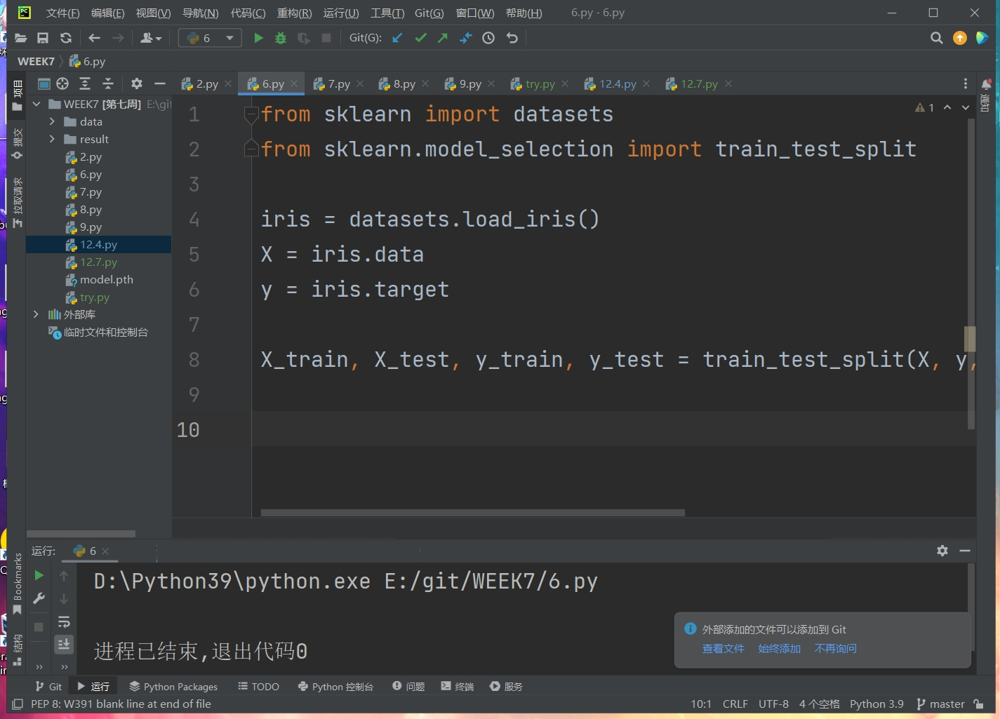
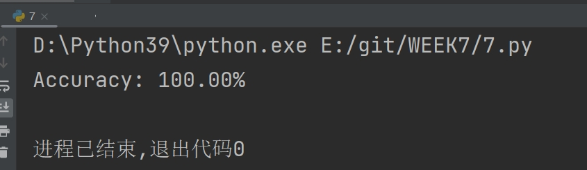
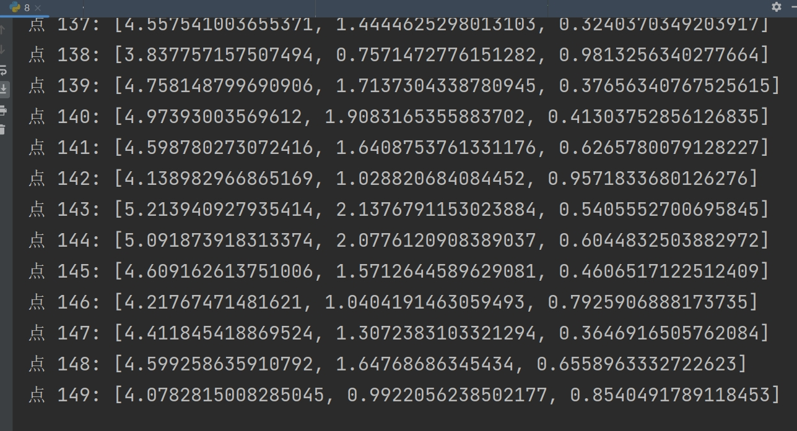
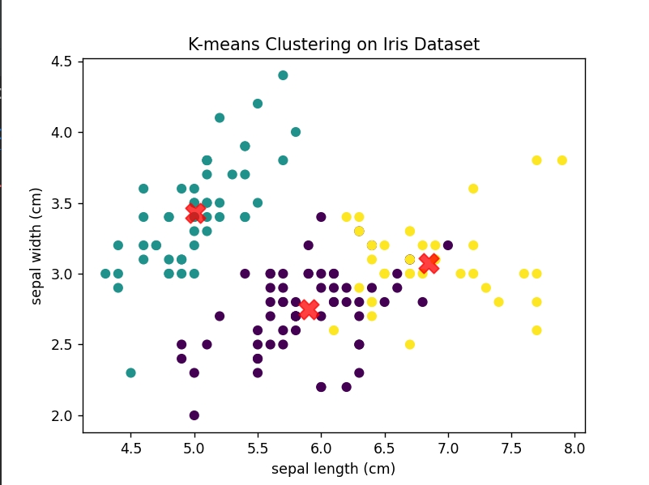
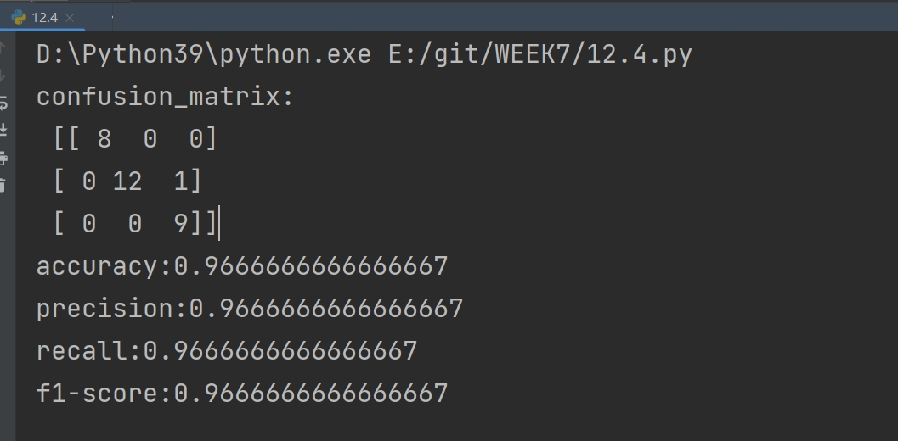
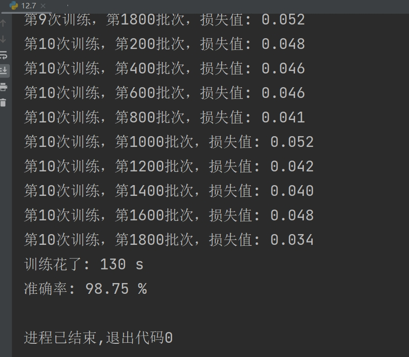

## 5：
### Logistic 回归模型基础

1. **Sigmoid 函数**:
    Logistic回归使用Sigmoid函数，将线性回归结果映射到[0,1]区间，用于预测二元目标变量的概率。Sigmoid函数定义如下：
    $$
    \sigma(z) = \frac{1}{1 + e^{-z}}
    $$

2. **模型假设**:
   Logistic回归模型假设目标变量`y`的对数几率是输入`X`的线性组合。这里，`z`代表线性组合：`z = w^T X + b`，其中`w`是权重向量，`b`是偏差项。

3. **代价函数**:
   我们使用交叉熵损失函数，因为这会使得梯度下降优化更加有效。对于单个数据点，损失函数是：
   $$
   J(w, b) = -y \log(\sigma(z)) - (1 - y) \log(1 - \sigma(z))
   $$
   对于整个训练集，代价函数是所有训练样本损失的平均。

### 梯度下降求解

梯度下降是一种迭代优化算法，用于最小化代价函数。基本思想是计算代价函数的梯度，并沿着减少最快的方向调整参数。

1. **计算梯度**:
   首先，我们需要计算代价函数相对于模型参数的梯度。对于权重`w`和偏差`b`，梯度计算如下：
   $$
   \frac{\partial J}{\partial w} = \frac{1}{N} \sum_{i=1}^{N} (\sigma(z^{(i)}) - y^{(i)})x^{(i)}
   $$
   $$
   \frac{\partial J}{\partial b} = \frac{1}{N} \sum_{i=1}^{N} (\sigma(z^{(i)}) - y^{(i)})
   $$
   其中`N`是训练样本的数量。

2. **更新规则**:
   然后，我们用以下规则更新参数：
   $$
   w = w - \alpha \frac{\partial J}{\partial w}
   $$
   $$
   b = b - \alpha \frac{\partial J}{\partial b}
   $$
   其中，`α`是学习率，控制我们更新参数的步长。

3. **迭代优化**:
   通过多次迭代过程，我们不断用计算出的梯度更新参数，直到代价函数收敛为止。

### 算法步骤总结

1. 初始化模型参数（通常初始化为0或小的随机值）。
2. 计算模型的预测输出。
3. 计算代价函数（损失）。
4. 计算代价函数的梯度。
5. 更新模型参数。
6. 重复步骤2-5，直到满足停止准则（例如，达到预定的迭代次数，或代价函数的改变非常小）。

## 7和8
