# 题目：对2022-2023赛季NBA球员薪水及状态的数据分析与可视化
# 一、项目概述
## 1.1数据集介绍：
### 数据来源于Kaggle上名为NBA Player Salaries (2022-23 Season)的数据集。数据链接为。https://www.kaggle.com/datasets/jamiewelsh2/nba-player-salaries-2022-23-season 。数据集包含了2022-2023赛季所有球员的薪水以及详细的个人比赛数据。

## 1.2研究意义：
### NBA，作为当今最热门的篮球联赛，随着其快速发展，nba球员的薪资也水涨船高。我们不由得思考，在当今联盟的比赛节奏中，球员的哪些数据更能决定其薪资水平，联盟球员的薪资分布情况。并进一步根据当前赛季的工资帽占比推测出球员的薪资水平。

# 二、数据清洗和预处理
## 1.数据导入
### 先导入需要用到的库。pandas库用来处理数据，对数据进行读取，清洗，分组，聚合，合并等。numpy库进行数值计算，如矩阵，向量等。matplotlib库与seaborn库，用于绘制各类图形。
    import pandas as pd
    import numpy as np
    import matplotlib.pyplot as plt
    import seaborn as sns
    %matplotlib inline
### 从数据集中读出数据
    # 读出所有数据
    data = pd.read_csv('/git/final project/data/nba_2022-23_all_stats_with_salary.csv')
    # 删除没有意义的一列
    data.drop(data.columns[0],axis=1,inplace=True)
    data.columns

    # 包含以下球员数据
    Index(['Player Name', 'Salary', 'Position', 'Age', 'Team', 'GP', 'GS', 'MP',
        'FG', 'FGA', 'FG%', '3P', '3PA', '3P%', '2P', '2PA', '2P%', 'eFG%',
        'FT', 'FTA', 'FT%', 'ORB', 'DRB', 'TRB', 'AST', 'STL', 'BLK', 'TOV',
        'PF', 'PTS', 'Total Minutes', 'PER', 'TS%', '3PAr', 'FTr', 'ORB%',
        'DRB%', 'TRB%', 'AST%', 'STL%', 'BLK%', 'TOV%', 'USG%', 'OWS', 'DWS',
        'WS', 'WS/48', 'OBPM', 'DBPM', 'BPM', 'VORP'],
        dtype='object')

### 查看数据前五行
    data.head()     

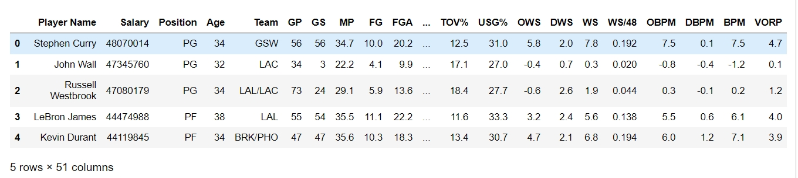
### 我们可以看到该数据的前五行是按2022-23赛季薪资排序的，分别是库里、沃尔、威少、詹姆斯和杜兰特。而数据包含51列，即不同维度的技术统计。此份数据提供了这400+球员的众多项比赛数据，我希望通过数据分析来发现其中的有趣的信息。

### 对主要球员数据的解释：
### Player Name 球员姓名、Salary 薪资、Position 司职位置
### Age 年龄、Team 球队、GP 出场次数
### GS 首发次数、MP 场均出场时间、FG 场均投篮命中数
### FGA 场均出手次数、FG% 投篮命中率、3P 3分球命中球数
### 3PA 3分球出手次数、3P% 3分球命中率、2P 2分球命中球数
### 2PA 2分球出手次数、2P% 2分球命中率=、eFG% 有效命中率=
### FT 罚球命中数、FTA 罚球次数、FT% 罚球命中率
### ORB 进攻篮板、DRB 防守篮板、TRB 总篮板
### AST 助攻数、STL 抢断数、BLK 盖帽
### TOV 失误、PF 个人犯规、PTS 得分数
### Total Minutes 总时长、PER 球员效率值、TS% 真实命中率
### FTrFree 罚球率、OWS 进攻贡献、DWS 防守贡献
### WS 贡献、OBPM 进攻正负值、DBPM 防守正负值
### BPM 正负值、VORP 球员不可替代值

## 2.数据清洗
### 查看数据集中的缺失值数量
    data.isna().sum()

    Player Name       0
    Salary            0
    Position          0
    Age               0
    Team              0
    GP                0
    GS                0
    MP                0
    FG                0
    FGA               0
    FG%               1
    3P                0
    3PA               0
    3P%              13
    2P                0
    2PA               0
    2P%               4
    eFG%              1
    FT                0
    FTA               0
    FT%              23
    ORB               0
    DRB               0
    TRB               0
    AST               0
    STL               0
    BLK               0
    TOV               0
    PF                0
    PTS               0
    Total Minutes     0
    PER               0
    TS%               1
    3PAr              1
    FTr               1
    ORB%              0
    DRB%              0
    TRB%              0
    AST%              0
    STL%              0
    BLK%              0
    TOV%              0
    USG%              0
    OWS               0
    DWS               0
    WS                0
    WS/48             0
    OBPM              0
    DBPM              0
    BPM               0
    VORP              0
    dtype: int64
### 查看数据集中各数据类型，大部分都是浮点数。
    Player Name       object
    Salary             int64
    Position          object
    Age                int64
    Team              object
    GP                 int64
    GS                 int64
    MP               float64
    FG               float64
    FGA              float64
    FG%              float64
    3P               float64
    3PA              float64
    3P%              float64
    2P               float64
    2PA              float64
    2P%              float64
    eFG%             float64
    FT               float64
    FTA              float64
    FT%              float64
    ORB              float64
    DRB              float64
    TRB              float64
    AST              float64
    STL              float64
    BLK              float64
    TOV              float64
    PF               float64
    PTS              float64
    Total Minutes      int64
    PER              float64
    TS%              float64
    3PAr             float64
    FTr              float64
    ORB%             float64
    DRB%             float64
    TRB%             float64
    AST%             float64
    STL%             float64
    BLK%             float64
    TOV%             float64
    USG%             float64
    OWS              float64
    DWS              float64
    WS               float64
    WS/48            float64
    OBPM             float64
    DBPM             float64
    BPM              float64
    VORP             float64
    dtype: object
### 观察数据集发现，缺失值多半是概率值，缺失的原因是因为分母分子都为0.因此把缺失值都换为0就行。
    data.fillna(0,inplace=True)
    data.isna().sum()

# 三、基本数据分析
## 1.描述统计
    data.describe()
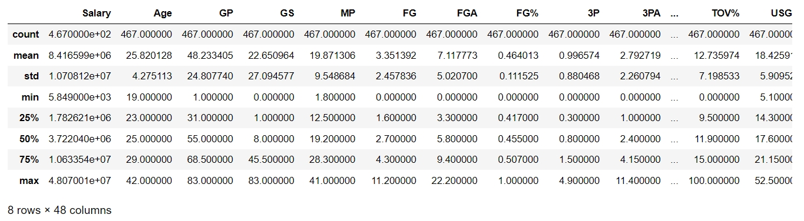
### 从这部分统计我们可以看出该赛季平均年薪为841万美元，最高年薪为4807万美元。球员平均年龄为25.8岁，年龄最大的达到了42岁，最小的只有19岁。一名球员一赛季平均能出场48.23场，平均每场19.8分钟。

## 2.球员薪资分布统计，年龄分布统计
    sns.set(font_scale=1.5)
    sns.set_style("whitegrid")
    plt.figure(figsize=(10,6))
    #绘制直方图
    data['Salary'].hist(bins = 20,
        histtype = 'bar',
        align = 'left',
        orientation = 'vertical',
        alpha=0.5,
        density =True)
    data['Salary'].plot(kind='kde',style='k--')
    plt.xlabel('SALARY')
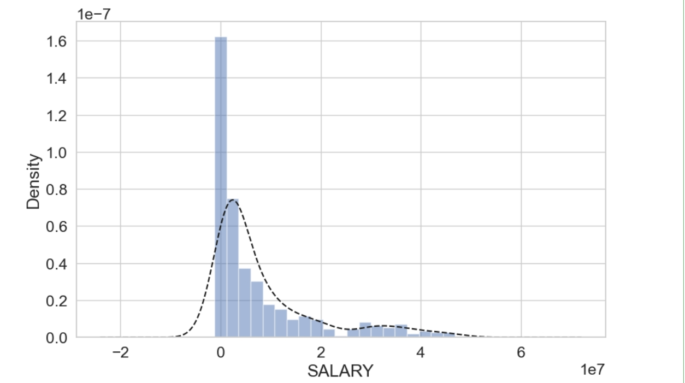

    sns.set(font_scale=1.5)
    sns.set_style("whitegrid")
    plt.figure(figsize=(10,6))
    data['Age'].hist(bins = 20,
        histtype = 'bar',
        align = 'left',
        orientation = 'vertical',
        alpha=0.5,
        density =True)
    data['Age'].plot(kind='kde',style='k--')
    plt.xlabel('AGE')
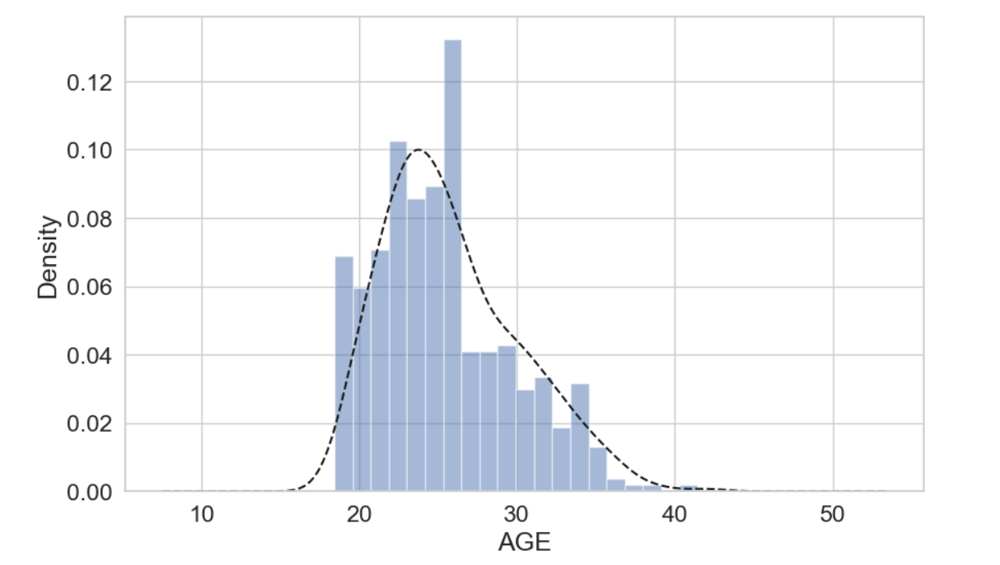
### 可以看到大部分球员的工资还是较低的，拿高薪的球员只占少数.而球员的年龄分布类似于正态分布，主要集中在25，26岁这个年龄。

## 3.探索性分析
### (1).球员年龄和球员薪水之间的关系
    dat1=data.loc[:,['WS','Salary','Age','PTS']]
    sns.jointplot(x=dat1.Salary,y=dat1.Age,data=dat1,kind='kde') 
### 使用sns库中的jointplot函数双变量绘图，得出球员薪水与年龄之间的关系。根据下图可以得出，大部分年轻球员的年薪都在1000万美金以下。少部分年龄在25岁以下的明星球员可以拿到近4000万的年薪。联盟中持高薪的球员还是集中在30岁左右这个年龄段。
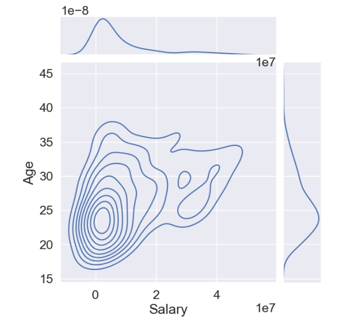

### (2).球员位置和球员薪水之间的关系
    sns.set(font_scale=1.5)
    sns.set_style("whitegrid")
    plt.figure(figsize=(10,6))
    ax = sns.lmplot(x='Age', y='Salary', data=data, hue='Position', fit_reg=False, aspect=2, legend=False, scatter_kws={"s": 200})
    ax.set(xlabel='AGE', ylabel='Salary',title="Salary by Position: 2022-2023 Season")
    plt.legend(loc='upper left', title='Position')

    plt.figure(figsize=(10,6))
    ax = sns.barplot(x="Position", y="Salary",data=data,capsize=.2)
### 进一步数据可视化，age为x轴，salary为y轴，并用球员位置进行分类。分别绘制点状图和柱状图。
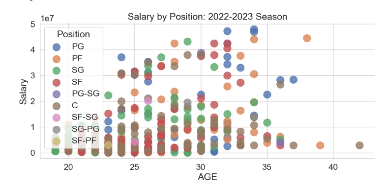
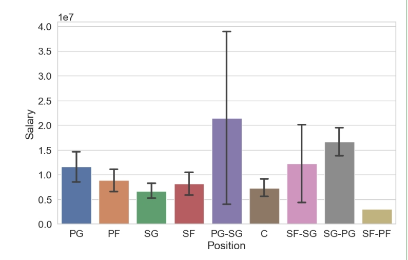
### 通过上图我们可以发现，PG(控球后卫)在高薪球员中占据了较大部分，而C(中锋)比例较少，可以反映出目前联盟更注重外线球员的情况。C(中锋)和SG(得分后卫)的平均薪资较低。PG-SG人数较少，薪资差距大，所以标准差较大。
## 4.相关性分析
### 先通过热图了解不同比赛数据与薪资之间的相关性。
    coor=data.corr()
    fig,ax=plt.subplots(1,1,figsize=(60,50))
    sns.heatmap(coor,square=True, linewidths=1, annot=True) 
    #seaborn中的heatmap函数，是将多维度数值变量按数值大小进行交叉热图展示。
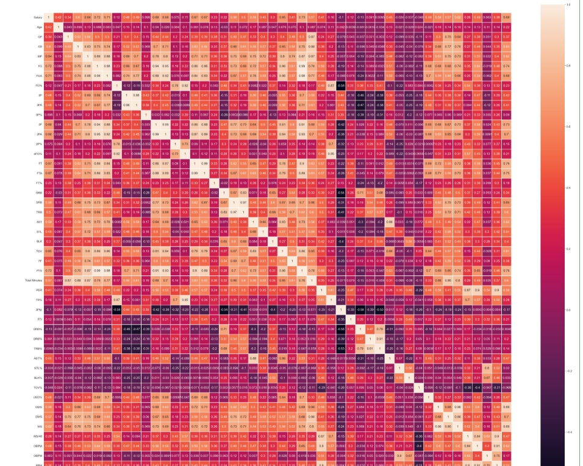
### 再从中挑出和Salary相关性最高的几个数据进一步观察
    dat1=data.loc[:,['Salary','MP','FGA','2PA','FTA','AST','WS','TOV','PTS','VORP']]
    coor=dat1.corr()
    fig,ax=plt.subplots(1,1,figsize=(15,14))
    sns.heatmap(coor,square=True, linewidths=1, annot=True)
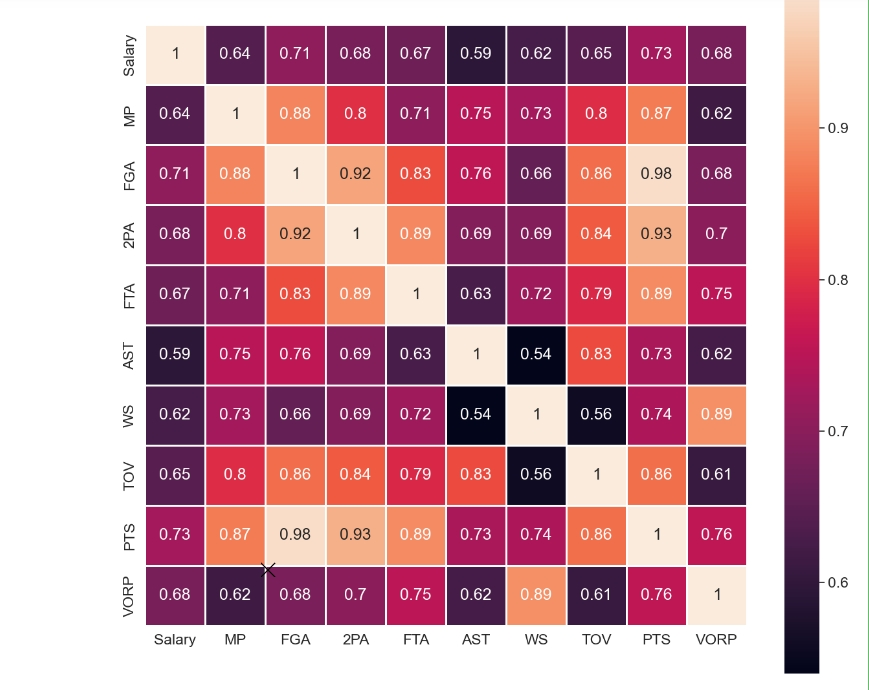
### 由上图发现PTS(场均得分)和VORP(球员不可替代值)还有FGA(场均出手数)和salary的相关性最高。
### 最后使用多变量图，更直观的感受变量之间的相关性。
    dat1=data.loc[:,['Salary','FGA','2PA','FTA','PTS','VORP']]
    sns.pairplot(dat1)
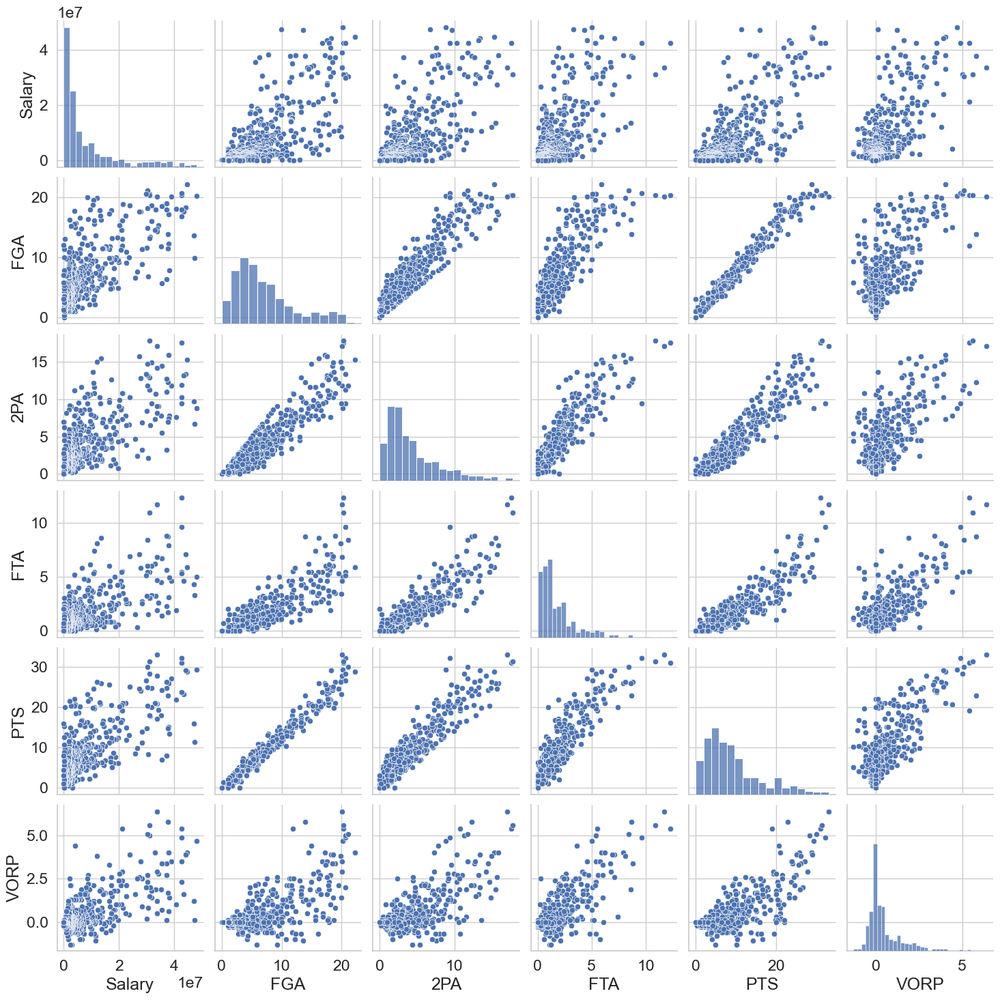
### 可以看到和salary相关的点大都集中在左下角，即薪资较低且各项数据相对较低的球员在联盟中占大多数。而且整体上呈线性关系，各项数据更好的球员薪资更高，但也不乏比赛数据较差但薪资较高或是数据好但薪资低的球员，各俱乐部也可以根据此数据对未来球员的薪资作出调整。
### 此外，我们观察到FGA和PTS是呈强线性相关，这也符合我们的认知，出手数越多，得到的分数也会越多。

# 四、薪资预测
## (1).数据处理
### 我们将根据球员薪资的工资帽占比来预测薪资。所以我们引入Cap_percent这一数据。查的该赛季工资帽为1.2365亿。
    data2['Cap_percent']=data2['Salary']/123655000
    data2.head()
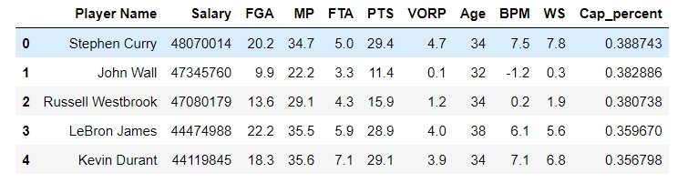
### 而后我们根据球员的薪资将球员分为5类。
    conditions = [
            (data2['Cap_percent']  < 0.03),
            (data2['Cap_percent']  <= 0.05),
            (data2['Cap_percent']  <= 0.15),
            (data2['Cap_percent']  <= 0.20),
            (data2['Cap_percent']  > 0.20)
    ]
    choices = [1,2,3,4,5]
    data2['Nominal'] = np.select(conditions, choices, default=3)
    data2.head(10)
### 再分别画出它的饼状图和条形图
    color_wheel = {0: "#0392cf", 
                1: "#7bc043"}
    colors = data2['Nominal'].map(lambda x: color_wheel.get(x))
    print(data2.Nominal.value_counts())
    p=data2.Nominal.value_counts('Nominal').plot(kind="pie")
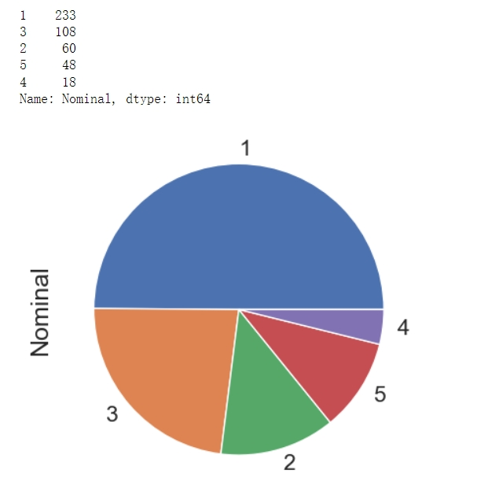
    
    #薪资分布条形图
    bar1=data2['Nominal'].value_counts()
    sns.set(font_scale=2)
    sns.set(style="white", palette="muted",color_codes=True)
    plt.figure(figsize=(10,7))
    ax = sns.barplot(x=bar1.index,y=bar1 )
    ax.set(xlabel='Level',ylabel='Number',title="Salary_Level")
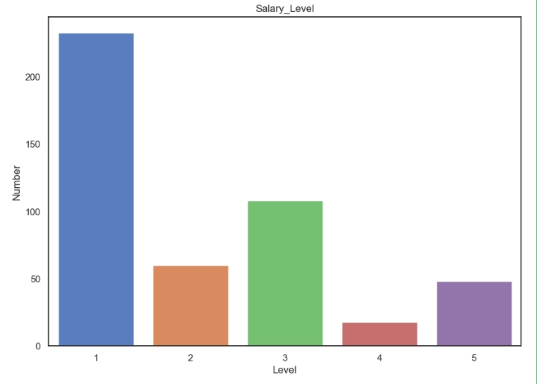

### 先划分测试集和训练集还有验证集
    from sklearn.neighbors import KNeighborsRegressor
    from sklearn.model_selection import train_test_split
    from sklearn.neighbors import KNeighborsClassifier
    data_test=data2[['MP','Age','BPM','VORP','Cap_percent','Nominal','WS']]
    data_test.shape
    x = data_test[['MP','Age','BPM','VORP']]
    y = data_test['Nominal']

    x_model, x_test, y_model, y_test = train_test_split(x, y, test_size=0.2, random_state=1)
    x_train, x_val, y_train, y_val = train_test_split(x_model, y_model, test_size=0.25, random_state=1)
### 使用KNN算法
### 模型微调
    # 寻找K

    from sklearn.neighbors import KNeighborsClassifier
    from sklearn.model_selection import KFold

    train_scores = []
    validation_scores = []

    x_model_values = x_model.values
    y_model_values = y_model.values

    # 5-fold cross validation

    kfold = KFold(2, shuffle=True, random_state=42)

    for i in range(1,20):
        knn = KNeighborsClassifier(i)
        
        tr_scores = []
        va_scores = []
        
        for a, b in kfold.split(x_model_values):

            x_train_fold, y_train_fold = x_model_values[a], y_model_values[a]
            x_val_fold, y_val_fold = x_model_values[b], y_model_values[b]
            
            knn.fit(x_train_fold, y_train_fold.ravel())
            
            va_scores.append(knn.score(x_val_fold, y_val_fold))
            tr_scores.append(knn.score(x_train_fold, y_train_fold))
            
        validation_scores.append(np.mean(va_scores))
        train_scores.append(np.mean(tr_scores))

    plt.title('k-NN Varying number of neighbours')
    plt.plot(range(1,20),validation_scores,label="Validation")
    plt.plot(range(1,20),train_scores,label="Train")
    plt.legend()
    plt.xticks(range(1,20))
    plt.show()

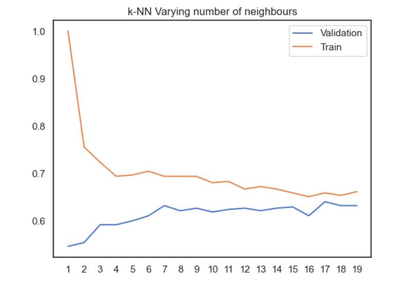
### 测试当K等于不同的值时，训练集和验证集的得分情况。由此图发现，当K=5后，两者得分开始趋近。

    # Learning Curve

    # How KNN algorithm performs in both small-size data and big-size data 

    from sklearn.model_selection import learning_curve

    train_sizes, train_scores, val_scores = learning_curve(KNeighborsClassifier(5), 
            x_model, 
            y_model,
            # Number of folds in cross-validation
            cv=5,
            # Evaluation metric
            scoring='accuracy',
            # Use all computer cores
            n_jobs=-1, 
            # 50 different sizes of the training set
            train_sizes=np.linspace(0.1, 1.0, 5))

    # Create means and standard deviations of training set scores
    train_mean = np.mean(train_scores, axis=1)
    train_std = np.std(train_scores, axis=1)

    # Create means and standard deviations of validation set scores
    val_mean = np.mean(val_scores, axis=1)
    val_std = np.std(val_scores, axis=1)

    # Draw lines
    plt.plot(train_sizes, train_mean, '--', color="#ff8040",  label="Training score")
    plt.plot(train_sizes, val_mean, color="#40bfff", label="Cross-validation score")

    # Draw bands
    plt.fill_between(train_sizes, train_mean - train_std, train_mean + train_std, color="#DDDDDD")
    plt.fill_between(train_sizes, val_mean - val_std, val_mean + val_std, color="#DDDDDD")

    # Create plot
    plt.title("Learning Curve \n k-fold=5, number of neighbours=5")
    plt.xlabel("Training Set Size"), plt.ylabel("Accuracy Score"), plt.legend(loc="best")
    plt.tight_layout()
    plt.show()
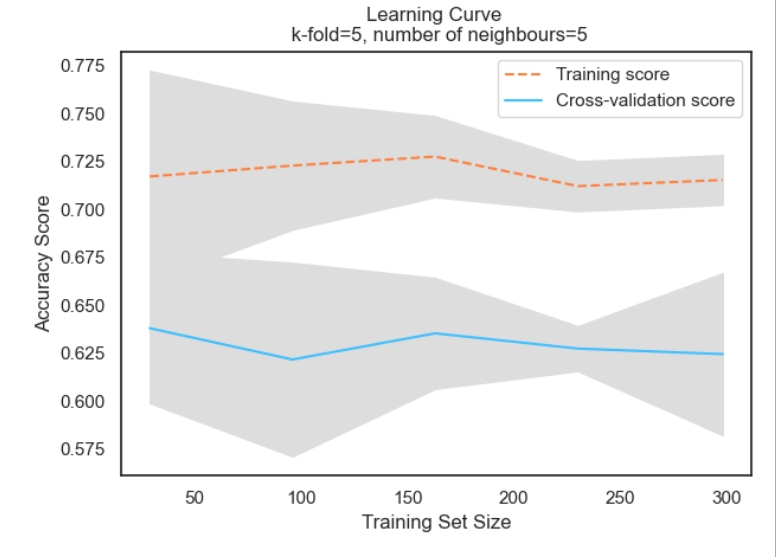
### 接着，我们根据k=5，使用learning curve函数计算KNN模型在不同训练集大小下的训练集得分和验证集得分。使用 plt.plot 绘制训练集得分和验证集得分的曲线。并绘制曲线上方的标准差带，表示得分的方差范围。该学习曲线使我们了解模型的性能与训练数据样本数量之间的关系。我们发现模型并不存在过拟合与欠拟合的问题。且已经充分训练，不需要更多的训练数据来改善模型的性能。

    # curse of dimensionality

    X = data[['PTS','VORP','OBPM','MP','DRB']]
    Y = data_test['Nominal']

    X_model, X_test, Y_model, Y_test = train_test_split(X, Y, test_size=0.2, random_state=1)
    X_train, X_val, Y_train, Y_val = train_test_split(X_model, Y_model, test_size=0.25, random_state=1)
    # [:, :2]extract columns

    # convert[[1],[2],[3],...] to [1,2,3,4,0]
    # x_train_values_list = np.array(x_train_values).tolist() 

    d_train = []
    d_val = []

    X_train_values = X_train.values
    Y_train_values = Y_train.values
    X_val_values = X_val.values
    Y_val_values = Y_val.values

    for i in range(1,23):
        
        X_train_value = X_train_values[:,:i].tolist() #convert dataframe
        X_val_value = X_val_values[:,:i].tolist()
        
        knn = KNeighborsClassifier(5)
        Knn = knn.fit(X_train_value, Y_train_values.ravel())

        d_train.append(Knn.score(X_train_value, Y_train_values))
        d_val.append(Knn.score(X_val_value, Y_val_values))

    plt.title('k-NN Curse of Dimensionality')
    plt.plot(range(1,23),d_val,label="Validation")
    plt.plot(range(1,23),d_train,label="Train")
    plt.xlabel('Number of Features')
    plt.ylabel('Score (Accuracy)')
    plt.legend()
    plt.xticks(range(1,23))
    plt.show()
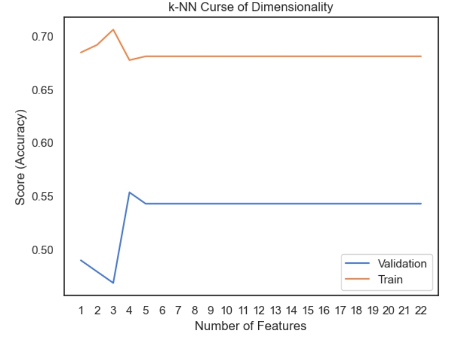
### 这段代码的目的是观察在不断增加特征维度的情况下，KNN算法的训练集和验证集的准确率。我们发现，随着维度增加训练集和验证集的准确率都没有下降，且超过5后都基本平稳，因此维度为5较为合适。

    # K=5时变现最好

    #Setup a knn classifier with k neighbors

    kfold = KFold(5, shuffle=True, random_state=42)
    knn = KNeighborsClassifier(5)

    for m,n in kfold.split(x_model_values):
            
            x_train_fold, y_train_fold = x_model_values[m], y_model_values[m]
            
            Knn = knn.fit(x_train_fold, y_train_fold.ravel())

    print('When k=5, the testing score(accuracy) is: ')
    print(Knn.score(x_test,y_test))
### 进行最终测试，在测试集上的准确率为0.6808
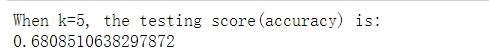

    from sklearn.metrics import accuracy_score, confusion_matrix, precision_recall_fscore_support

    y_predict = knn.predict(x_test)
    cm = confusion_matrix(y_test, y_predict) 

    # Transform to df for easier plotting
    cm_df = pd.DataFrame(cm,
                        index = ['edge players','normal players','first player','stars', 'superstars'], 
                        columns = ['edge players','normal players','first player','stars', 'superstars'])

    plt.figure(figsize=(5.5,4))
    sns.heatmap(cm_df, annot=True)
    plt.title('Naive Bayes \nAccuracy:{0:.3f}'.format(accuracy_score(y_test, y_predict)))
    plt.ylabel('True label')
    plt.xlabel('Predicted label')
    plt.show()

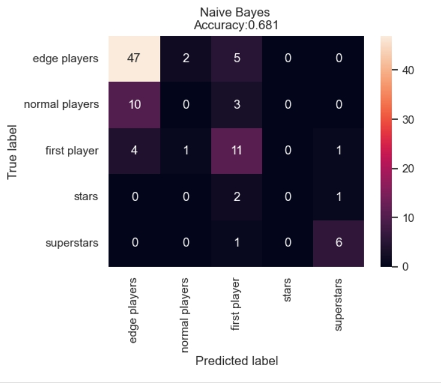
### 最后展示模型的分类效果。使用confusion_matrix，用来评估分类模型性能的常用工具，展示实际类别和预测类别。对角线上的都是预测正确的。