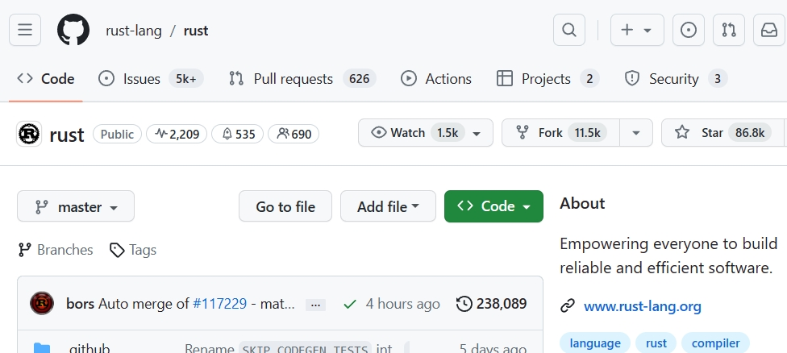
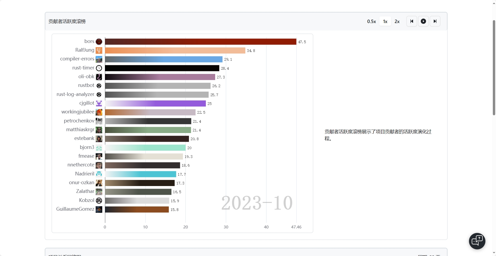
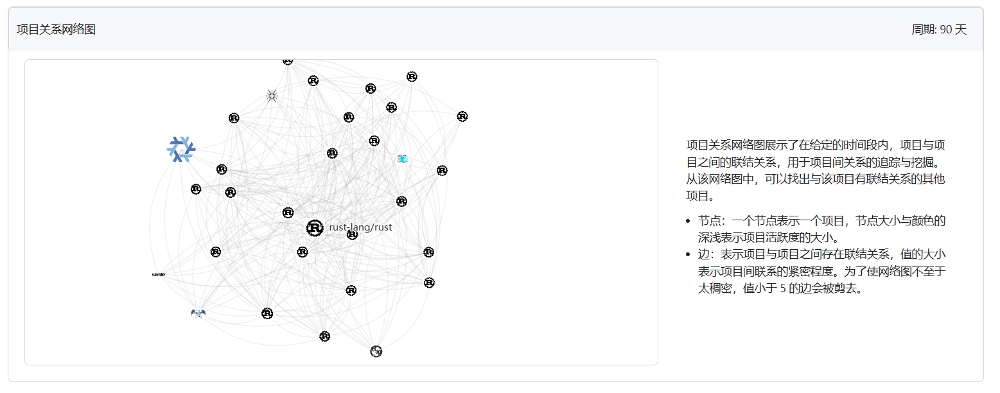
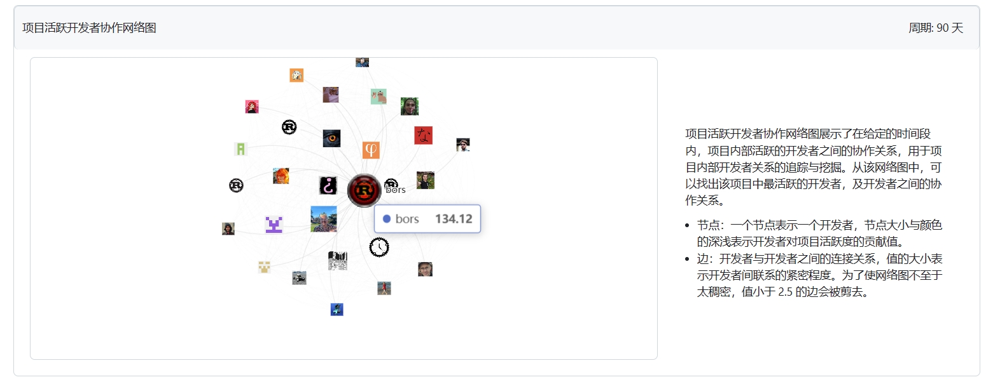
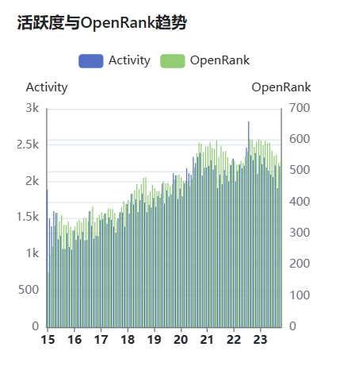
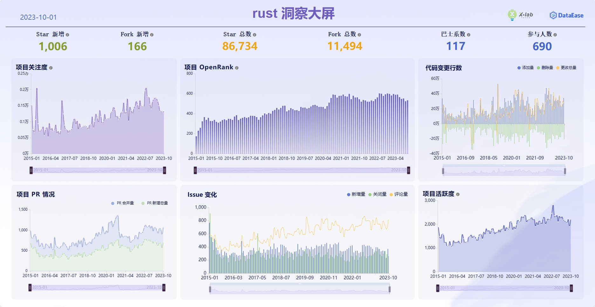

# 用 OpenLeaderboard 探索rust项目中的各种活动与指标数据
# 陈稷豪 10225102494

## 这是一个主要的rust代码仓库，包含编译器，标准库和文档。

## 以下是2023/10的贡献者活跃度滚榜，翻阅多页可以发现，bors用户的活跃度一直遥遥领先，是主要贡献者。

## 项目关系网络图，可以看出有多个rust项目与之关联，且关联紧密，关系很多。

## 项目活跃开发者网络图，该项目具有许多活跃的开发者。

## 可以发现rust的活跃度近几年一直在提升，但在最近几月有所下降。 

## 总结：hypercrx使得我们能更快了解一个仓库的活跃程度以及趋势，将数据可视化，从而更好的得出结论。